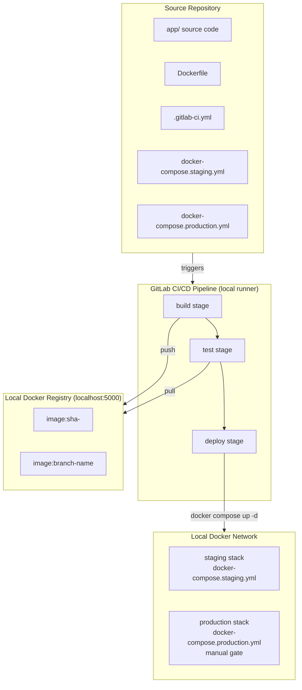
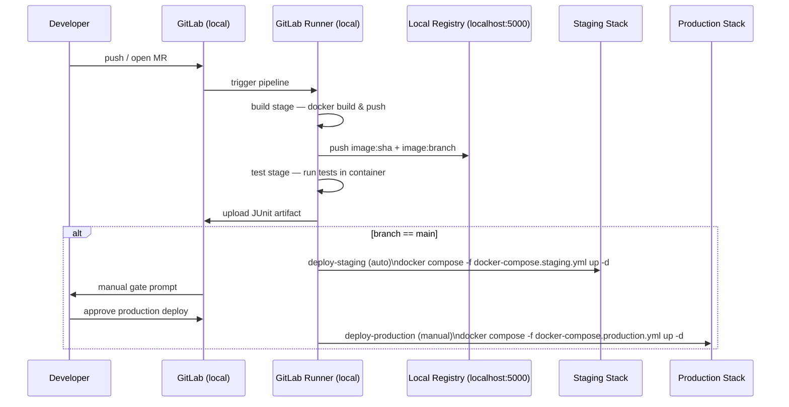

# Design Document: CI/CD Pipeline Automation

## Overview

This project delivers a complete, locally-runnable GitLab CI/CD pipeline for a containerized web application. The pipeline automates the full software delivery lifecycle: building a Docker image from source, running automated tests inside a container, deploying to a local `staging` Docker Compose stack on every merge to `main`, and gating production releases behind a manual approval step that brings up a local `production` Docker Compose stack.

The design targets GitLab CI/CD as the orchestration platform, a local Docker registry (`registry:2` on `localhost:5000`) for image storage, and Docker Compose for local environment management. A minimal Python HTTP application (Flask) serves as the pipeline subject, providing a realistic but self-contained artifact to build, test, and deploy. The entire pipeline is runnable on a developer's machine with Docker installed — no remote VMs, cloud environments, or SSH access required.

Key design goals:
- Predictable stage ordering with hard failure gates between stages
- Immutable image promotion — the exact SHA built once is what reaches production
- Zero hardcoded secrets — all credentials flow through GitLab CI/CD variables
- Fast feedback loops via dependency caching and merge-request pipelines
- Full observability through artifacts, dotenv passthrough, and GitLab Environments
- Fully local execution using `gitlab-runner exec` or a GitLab Runner in Docker

---

## Architecture

The system is composed of three layers:

1. **Source Repository** — contains the application code, `Dockerfile`, Docker Compose files, and `.gitlab-ci.yml`
2. **GitLab CI/CD Platform** — schedules and executes pipeline jobs on a local GitLab Runner (via `gitlab-runner exec` or Runner in Docker)
3. **Local Deployment Targets** — `staging` and `production` Docker Compose stacks running on the developer's local Docker network



### Pipeline Stage Flow



---

## Components and Interfaces

### 1. `.gitlab-ci.yml` — Pipeline Definition

The central configuration file. Defines stages, global defaults, and all job configurations.

Key sections:
- `stages:` — ordered list `[build, test, deploy]`
- `default:` — shared image, retry policy, and interruptible flag
- `variables:` — non-secret defaults (e.g., `IMAGE_NAME`, `PORT`, `LOCAL_REGISTRY=localhost:5000`)
- Job definitions for `build-image`, `test-unit`, `deploy-staging`, `deploy-production`
- `workflow: rules:` — controls when pipelines run (MR vs. branch push)
- Deploy jobs invoke `docker compose -f docker-compose.<env>.yml up -d` with the locally-built image

### 2. `Dockerfile` — Multi-Stage Build

Two stages:
- **builder** — installs all dependencies from `requirements.txt` (including dev deps) using pip into a virtual environment
- **runtime** — copies only the virtual environment and application source; runs as a non-root user

Exposes `PORT` (default `8080`) via `ENV`.

```dockerfile
# builder stage
FROM python:3.12-slim AS builder
WORKDIR /app
COPY requirements.txt .
RUN python -m venv /app/.venv && \
    /app/.venv/bin/pip install --no-cache-dir -r requirements.txt

# runtime stage
FROM python:3.12-slim AS runtime
WORKDIR /app
RUN adduser --disabled-password --gecos "" appuser
COPY --from=builder /app/.venv /app/.venv
COPY app/ ./app/
ENV PATH="/app/.venv/bin:$PATH" PORT=8080
USER appuser
CMD ["sh", "-c", "python -m flask --app app.main run --host 0.0.0.0 --port ${PORT}"]
```

### 3. Application (`app/`)

Minimal Python Flask HTTP server:
- `GET /health` → `200 OK` with JSON body `{"status": "ok"}`
- Listens on `os.environ.get("PORT", 8080)`
- Dependencies: `flask` only (no other runtime dependencies)

```python
# app/main.py
import os
from flask import Flask, jsonify

app = Flask(__name__)

@app.route("/health")
def health():
    return jsonify({"status": "ok"}), 200

if __name__ == "__main__":
    port = int(os.environ.get("PORT", 8080))
    app.run(host="0.0.0.0", port=port)
```

### 4. Local Docker Registry

A `registry:2` container running on `localhost:5000` serves as the local image store. Images are tagged as:
- `localhost:5000/$IMAGE_NAME:sha-$CI_COMMIT_SHORT_SHA`
- `localhost:5000/$IMAGE_NAME:$CI_COMMIT_REF_SLUG`

No authentication is required for a local registry. The runner must be configured to allow insecure registries for `localhost:5000`.

### 5. Docker Compose Environment Files

Two Compose files define the local deployment stacks:

**`docker-compose.staging.yml`**
```yaml
services:
  app:
    image: localhost:5000/${IMAGE_NAME}:${IMAGE_TAG}
    ports:
      - "8080:8080"
    environment:
      PORT: "8080"
    restart: unless-stopped
```

**`docker-compose.production.yml`**
```yaml
services:
  app:
    image: localhost:5000/${IMAGE_NAME}:${IMAGE_TAG}
    ports:
      - "8081:8080"
    environment:
      PORT: "8080"
    restart: unless-stopped
```

The deploy jobs set `IMAGE_NAME` and `IMAGE_TAG` from the dotenv artifact before invoking `docker compose up -d`.

### 6. CI/CD Variables (GitLab Project Settings)

| Variable | Description |
|---|---|
| `IMAGE_NAME` | Name of the image (e.g., `myapp`) — no registry prefix needed for local registry |
| `PORT` | Default application port (`8080`) |

No deployment tokens, remote URLs, or SSH keys are required. All registry operations target `localhost:5000`.

### 7. Dependency Cache

Cache key: `$CI_PROJECT_ID-$CI_COMMIT_REF_SLUG-${hash of requirements.txt}`

Cached paths: `.venv/` or the pip cache directory (`~/.cache/pip`)

Cache policy: `pull-push` on default branch jobs; `pull` on MR jobs.

---

## Data Models

### Pipeline Artifact: `build.env` (dotenv)

Passed from `build-image` to all downstream jobs via `artifacts: reports: dotenv`.

```
IMAGE_TAG=sha-abc1234
IMAGE_NAME=myapp
FULL_IMAGE_REF=localhost:5000/myapp:sha-abc1234
```

### JUnit Test Report Artifact

Produced by the `test-unit` job using `pytest` with the `pytest-junit` (or `pytest --junitxml`) option. Path: `reports/junit.xml`

Retained for 30 days. Surfaced in GitLab's Test Reports UI on MRs and pipelines.

```xml
<testsuites>
  <testsuite name="pytest" tests="N" failures="0" errors="0" time="...">
    <testcase classname="tests.test_health" name="test_health_returns_200" time="..."/>
    ...
  </testsuite>
</testsuites>
```

Test runner invocation:
```bash
pytest --junitxml=reports/junit.xml
```

### GitLab Environment Record

Created/updated by deploy jobs via `environment:` keyword.

```yaml
environment:
  name: staging
  action: start
```

Fields tracked by GitLab: `name`, `deployment_tier`, last deployed image ref, deployer identity, timestamp. No remote URL is tracked since deployments are local.

### Job Log Output (deploy jobs)

Each deploy job emits a structured log line:

```
[deploy] environment=staging image=localhost:5000/myapp:sha-abc1234
```

---

## Correctness Properties

*A property is a characteristic or behavior that should hold true across all valid executions of a system — essentially, a formal statement about what the system should do. Properties serve as the bridge between human-readable specifications and machine-verifiable correctness guarantees.*

### Property 1: No Hardcoded Secrets or Environment-Specific Values

*For any* string value in `.gitlab-ci.yml` or any committed script file, if that value looks like a credential, token, URL, or environment-specific configuration, it must be a CI/CD variable reference (i.e., `$VARIABLE_NAME`) rather than a literal string.

**Validates: Requirements 4.2, 9.1, 9.2**

### Property 2: Required Variable Guard Checks

*For any* job that depends on a required CI/CD variable, the job script must contain a guard that checks for the variable's presence and exits with a descriptive error before attempting to use it.

**Validates: Requirements 9.3**

### Property 3: JUnit XML Well-Formedness

*For any* test run, the produced XML report must be parseable as valid JUnit-format XML with at least one `<testsuite>` element containing `<testcase>` elements.

**Validates: Requirements 3.2**

### Property 4: Server Listens on Configured PORT

*For any* valid port number N, when the application server is started with `PORT=N`, it must accept HTTP connections on port N and respond to `GET /health` with status 200.

**Validates: Requirements 10.4**

---

## Error Handling

### Build Stage Failures

- `docker build` exits non-zero on Dockerfile syntax errors or missing files — GitLab marks the job failed automatically
- The build job does not suppress stderr; all Docker build output streams to the job log
- No downstream jobs run when the build job fails (GitLab stage ordering)

### Test Stage Failures

- `pytest` exits non-zero on test failures — GitLab marks the job failed
- The JUnit artifact is uploaded even on failure (`artifacts: when: always`) so the report is visible in the GitLab UI
- Missing dotenv artifact from the build job causes the test job to fail at startup with a clear variable-not-set error

### Deploy Stage Failures

- Staging deploy failure: GitLab does not update the environment record; the previous deployment remains active
- Production deploy failure: same behavior — no automatic rollback; the operator must re-trigger or roll back manually
- Missing required variables: guard scripts exit 1 with a message like `ERROR: IMAGE_TAG is not set` before any deployment command runs
- Docker Compose failures (e.g., port already in use, image not found in local registry): the job exits non-zero and the error is surfaced in the job log

### Missing Dockerfile

- `docker build` fails immediately with `unable to prepare context: unable to evaluate symlinks in Dockerfile path`
- The error appears in the job log; the build job is marked failed

### Cache Miss

- On cache miss, the job proceeds without the cache and installs dependencies fresh via `pip install -r requirements.txt`
- This is not an error condition; it is logged by the GitLab Runner

---

## Testing Strategy

### Dual Testing Approach

Both unit tests and property-based tests are required. They are complementary:
- Unit tests catch concrete bugs in specific scenarios and verify structural correctness of configuration files
- Property-based tests verify universal behaviors across a wide range of inputs

All tests are written in Python using **pytest** as the test runner. JUnit XML output is produced with `pytest --junitxml=reports/junit.xml`.

### Unit Tests (Specific Examples and Structural Checks)

These tests parse and validate the `.gitlab-ci.yml` and `Dockerfile` as data, and exercise the Flask application directly using pytest and the Flask test client.

| Test | What it checks | Requirement |
|---|---|---|
| Stage order | `stages` array equals `[build, test, deploy]` | 1.1 |
| Parallel jobs | No intra-stage `needs:` that would serialize same-stage jobs | 1.4 |
| Build job config | Script contains `docker build -f Dockerfile`, pushes with `$CI_COMMIT_SHORT_SHA` and `$CI_COMMIT_REF_SLUG` tags to `localhost:5000` | 2.1–2.4 |
| Test job image | Test job `image:` references `$FULL_IMAGE_REF` from dotenv | 3.1 |
| Test job services | Test job declares `services:` block for database | 3.5 |
| Staging rules | `deploy-staging` job has `rules:` restricting to `$CI_COMMIT_BRANCH == "main"` | 4.1 |
| Staging environment | `deploy-staging` declares `environment: name: staging` | 4.3 |
| Staging deploy command | `deploy-staging` script contains `docker compose -f docker-compose.staging.yml up -d` | 4.1 |
| Production manual gate | `deploy-production` has `when: manual` | 5.1 |
| Production image SHA | `deploy-production` uses same `$FULL_IMAGE_REF` variable | 5.3 |
| Production environment | `deploy-production` declares `environment: name: production` | 5.4 |
| Production deploy command | `deploy-production` script contains `docker compose -f docker-compose.production.yml up -d` | 5.3 |
| MR pipeline rules | `workflow: rules:` or job rules allow MR pipelines; deploy jobs exclude `merge_request_event` | 6.1, 6.2 |
| Cache key | Cache `key:` includes `requirements.txt` hash | 7.1 |
| Dotenv artifact | Build job declares `artifacts: reports: dotenv:` writing `IMAGE_TAG` and `FULL_IMAGE_REF` | 8.1 |
| Artifact retention | Test job `artifacts: expire_in:` is `30 days` or longer | 8.2 |
| Deploy log output | Deploy job scripts contain `echo` with `$IMAGE_TAG` and environment name | 8.4 |
| Compose files exist | `docker-compose.staging.yml` and `docker-compose.production.yml` are present in the repo | 11.4 |
| Local registry | Build job pushes to `localhost:5000` and deploy jobs pull from `localhost:5000` | 11.2 |
| Health endpoint | `GET /health` returns HTTP 200 with `{"status": "ok"}` | 10.1 |
| Multi-stage Dockerfile | Dockerfile contains ≥ 2 `FROM` instructions | 10.2 |
| Non-root user | Dockerfile final stage contains `USER` instruction with non-root user | 10.3 |

### Property-Based Tests

Use **Hypothesis** as the property-based testing library (Python). Each property test is decorated with `@given(...)` and runs a minimum of **100 iterations** (configured via `settings(max_examples=100)`).

Each test is tagged with a comment referencing the design property:
`# Feature: cicd-pipeline-automation, Property N: <property_text>`

---

**Property Test 1: No Hardcoded Secrets**
Tag: `Feature: cicd-pipeline-automation, Property 1: no hardcoded secrets or environment-specific values`

```python
from hypothesis import given, settings
from hypothesis import strategies as st

@given(st.text(min_size=8))
@settings(max_examples=100)
def test_no_hardcoded_secrets(random_credential):
    # Feature: cicd-pipeline-automation, Property 1: no hardcoded secrets or environment-specific values
    # For any credential-like string, it must not appear as a literal in .gitlab-ci.yml
    yaml_content = Path(".gitlab-ci.yml").read_text()
    assert random_credential not in yaml_content or random_credential.startswith("$")
```

Additionally, statically scan all string literals in the YAML against a pattern list (token-like strings, non-variable config values) and assert all such values are variable references. Note: `localhost:5000` is an acceptable literal since it is a fixed local address, not a secret.

**Validates: Requirements 4.2, 9.1, 9.2**

---

**Property Test 2: Required Variable Guard Checks**
Tag: `Feature: cicd-pipeline-automation, Property 2: required variable guard checks in job scripts`

For each job that declares a required variable, generate a set of environment states where that variable is absent. Assert that the guard script (parsed from the job's `script:` block) would exit before the first use of the variable.

**Validates: Requirements 9.3**

---

**Property Test 3: JUnit XML Well-Formedness**
Tag: `Feature: cicd-pipeline-automation, Property 3: JUnit XML is valid and well-formed`

```python
from hypothesis import given, settings
from hypothesis import strategies as st
import xml.etree.ElementTree as ET

test_case_strategy = st.fixed_dictionaries({
    "name": st.text(min_size=1),
    "classname": st.text(min_size=1),
    "passed": st.booleans(),
    "duration": st.floats(min_value=0.0, max_value=60.0),
})

@given(st.lists(test_case_strategy, min_size=1))
@settings(max_examples=100)
def test_junit_xml_wellformed(test_cases):
    # Feature: cicd-pipeline-automation, Property 3: JUnit XML is valid and well-formed
    xml_output = generate_junit_xml(test_cases)
    root = ET.fromstring(xml_output)
    assert root.tag in ("testsuites", "testsuite")
    suites = root.findall("testsuite") if root.tag == "testsuites" else [root]
    assert len(suites) >= 1
    for suite in suites:
        assert len(suite.findall("testcase")) == len(test_cases)
```

**Validates: Requirements 3.2**

---

**Property Test 4: Server Listens on Configured PORT**
Tag: `Feature: cicd-pipeline-automation, Property 4: server listens on PORT env var`

```python
from hypothesis import given, settings
from hypothesis import strategies as st

@given(st.integers(min_value=1024, max_value=65535))
@settings(max_examples=100)
def test_server_listens_on_port(port):
    # Feature: cicd-pipeline-automation, Property 4: server listens on PORT env var
    with run_app(port=port) as base_url:
        response = requests.get(f"{base_url}/health")
        assert response.status_code == 200
        assert response.json() == {"status": "ok"}
```

**Validates: Requirements 10.4**
